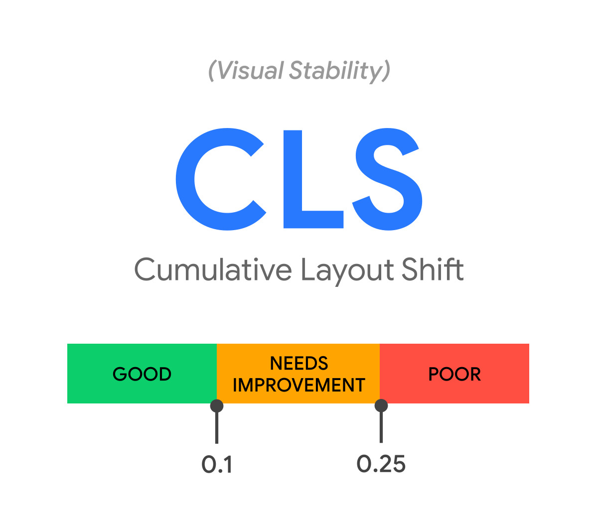
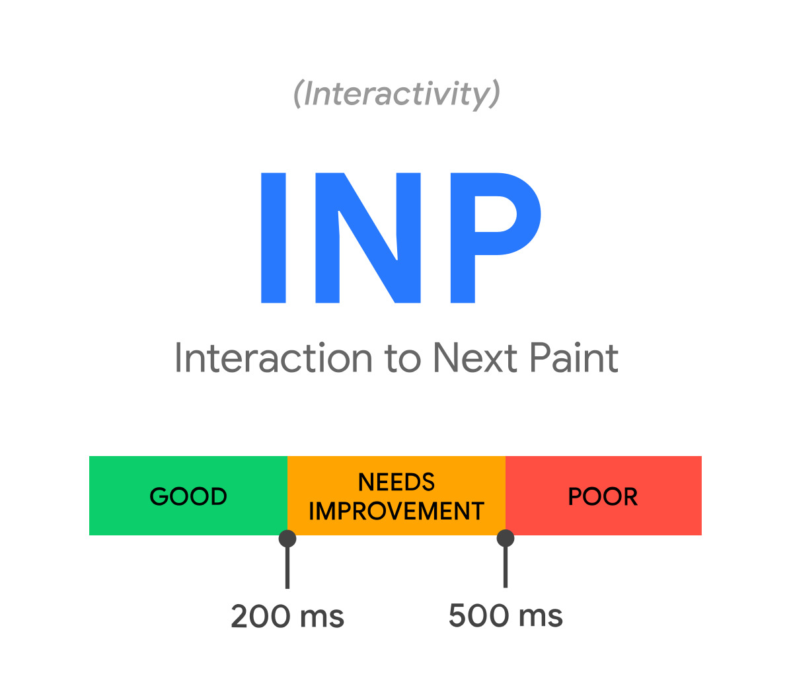
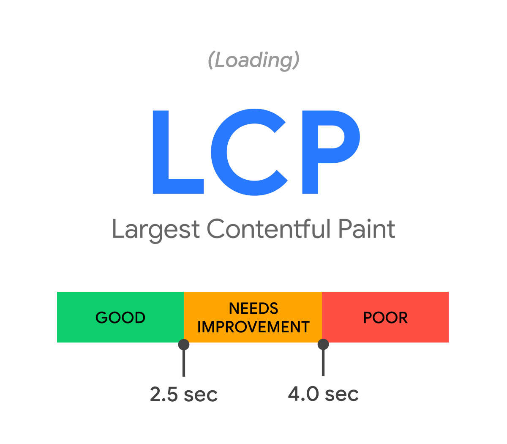

# PageSpeed Optimization

### What is Core Web Vitals

Core Web Vitals are standards that Google uses to evaluate a website’s technical health and inform rankings on its search engine results pages (SERPs).

There are three Core Web Vitals metrics:&#x20;

1. Largest Contentful Paint (LCP)
2. Interaction to Next Paint (INP)
3. Cumulative Layout Shift (CLS)

#### Largest Contentful Paint (LCP)&#x20;

Measures loading performance. To provide a good user experience, LCP should occur within 2.5 seconds of when the page first starts loading.&#x20;

#### Interaction to Next Paint (INP)&#x20;

Measures interactivity. To provide a good user experience, pages should have a INP of 200 milliseconds or less.

#### Cumulative Layout Shift (CLS)&#x20;

Measures visual stability. To provide a good user experience, pages should maintain a CLS of 0.1. or less.

<figure><figcaption></figcaption></figure>

 

<figure><figcaption></figcaption></figure>

 

<figure><figcaption></figcaption></figure>

### How to optimize each metric

#### Largest Contentful Paint (LCP)

Check this guide out [here](https://web.dev/articles/optimize-lcp).

#### Interaction to Next Paint (INP)

Check this guide out [here](https://web.dev/articles/optimize-inp).

#### Cumulative Layout Shift (CLS)

Check this guide out [here](https://web.dev/articles/optimize-cls).

### Tips to optimize&#x20;

#### HTML

* Minimize HTML.
* Use Semantic HTML. Refer to this article: [What are Semantic Elements](https://www.w3schools.com/html/html5\_semantic\_elements.asp)?
* Validate Your HTML. Use [this tool](https://validator.w3.org/) to validate your HTML code.

#### CSS

* Minimize CSS
* Remove Unused CSS. Use [this tool](https://developer.chrome.com/docs/lighthouse/performance/unused-css-rules) to check and remove unused CSS.
* Optimize CSS for Above-the-Fold Content.
  * Critical Path CSS: Prioritize the loading of CSS that is needed for the content above the fold (the visible part of the page on initial load).
  * Async Loading: Load non-critical CSS asynchronously or defer its loading to prevent blocking the rendering of above-the-fold content.
* Avoid Inline CSS
* Use Shorthand Properties
* Optimize CSS Selectors
  * Avoid deep nested selectors, which can slow down rendering. Use more specific selectors that minimize the depth of the DOM tree traversal.
  * Universal selectors (\*) are inefficient and should be avoided.
* Leverage CSS Variables
  * Use CSS variables for repeated values (e.g., colors, font sizes) to reduce redundancy and make your CSS easier to maintain.
* Use Modern Layout Techniques
  * Utilize modern CSS layout techniques like Flexbox and CSS Grid instead of relying on older methods like floats and positioning, which can simplify your CSS.
* Optimize Web Fonts. &#x20;
  * Check [this article](https://web.dev/learn/performance/optimize-web-fonts) out.

#### Image

* Use the Right Format and sizes. Check [this article](https://web.dev/learn/performance/image-performance) out.
* Lazy Load Images. Check [this article](https://web.dev/learn/performance/lazy-load-images-and-iframe-elements) out.

#### Video

* Implement Lazy Loading. Check [this article](https://web.dev/articles/lazy-loading-video) out.
* Use Poster attribute in the \<video> tag to display a static image before the video starts playing, improving the visual experience before playback begins.

#### JS

* Minify and Compress JavaScript.
* Reduce and Defer JavaScript Loading
  * Load JS at the End of the Body: Place non-critical JS at the end of the \<body> tag to prevent it from blocking the initial rendering of the page.
  * Load JavaScript Asynchronously: Use the async or defer attributes in your \<script> tags to prevent JS from blocking the rendering of the page.
    * async: Downloads the script asynchronously and executes it as soon as it’s ready.
    * defer: Downloads the script asynchronously but only executes it after the HTML is fully parsed.
* Code Splitting
  * Break Up Large JS Files: Split your JavaScript into smaller chunks or modules that can be loaded on demand, rather than loading all of your JS upfront.
  * Dynamic Imports: Use dynamic import() statements to load JS files only when they are needed.
* Optimize DOM Access
  * Minimize DOM Manipulation: Batch DOM updates and use techniques like Document Fragments or Virtual DOM to reduce the number of reflows and repaints.
  * Cache DOM References: Store references to DOM elements in variables to avoid repeatedly querying the DOM, which can be performance-intensive.
* Reduce Unused JavaScript
* Optimize and Limit Third-Party Libraries
  * Use Lightweight Libraries: Replace heavy libraries with lighter alternatives when possible. For example, use native JavaScript features instead of jQuery if you only need basic functionality.
  * It would be better to use self writing code.
* Optimize Event Handling
  * Debounce and Throttle Events: Use debounce or throttle techniques to limit how often event handlers are called, especially for events like scrolling or resizing.
  * Delegate Events: Use event delegation to minimize the number of event listeners, particularly in scenarios involving dynamically added elements.
* Optimize JavaScript Execution
  * Use Web Workers: Offload heavy JavaScript computations to Web Workers to prevent blocking the main thread, which could cause UI lag.
  * Avoid Long-Running Scripts: Break up long-running scripts to allow the browser to perform other tasks, such as rendering and responding to user input.
* Using CSS instead of JavaScript
  * Consider using HTML and CSS primarily instead of JS. Check this blog for [example](https://blog.logrocket.com/5-things-you-can-do-with-css-instead-of-javascript/)
* Optimize with Lazy Loading
  * Lazy Load Non-Critical JS: Defer the loading of non-essential JS until it’s needed. This includes scripts for features like social media widgets, analytics, or ads.
* Avoid Memory Leaks
  * Manage Event Listeners: Ensure event listeners are properly removed when no longer needed to avoid memory leaks.
  * Use Closures Carefully: Avoid creating unnecessary closures that can lead to increased memory usage.
* Use Modern JavaScript Features
  * Leverage ES6+ Features
  * Web component

### To Sum Up

After all, we need to ensure that the performance of the features you’re working on scores greater than or equal to 90 on both mobile and desktop.

<figure><figcaption></figcaption></figure>

### Tools

* [Google Lighthouse](https://developer.chrome.com/docs/lighthouse/overview/#devtools)
* [GTmetrix](https://gtmetrix.com/)

### Reference

* [https://web.dev/learn/performance](https://web.dev/learn/performance)
* [https://shopify.dev/docs/storefronts/themes/best-practices/performance](https://shopify.dev/docs/storefronts/themes/best-practices/performance)
* [https://performance.shopify.com/](https://performance.shopify.com/)
