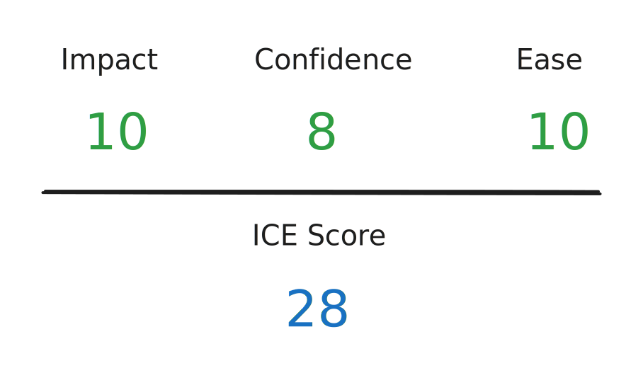

# 3. Choose one solution

In this step, we will evaluate the ICE score for each solution we found in [step 2](2.-find-multiple-solutions.md).

### Evaluate the first solution


The first solution is to insert page assets before all `</head>` tags and replace all occurrences of the `{{ content_for_layout }}` tag with page content in the layout template file.



For this solution, we can:

* &#x20;_**Score 10 for the impact factor**_ because the solution can resolve both the specified case and a similar case that replaces the `{{ content_for_layout }}` tag with page content ([step 1.3](1.-understand-the-issue.md#frame-the-issue)).
* _**Score 8 for the confidence factor**_ because the solution might duplicate the loading of page assets on other non-standard themes having multiple `</head>` tags but not placed inside a `if...else` statement.
* _**Score 10 for the ease factor**_ because the implementation of the solution can be rapid.


### Evaluate the second solution


The second solution is to wrap page assets in a dedicated `<head></head>` block and insert it right after the `<html>` tag.



For this solution, we can:

* &#x20;_**Score 6 for the impact factor**_ because the solution can resolve only the specified case and it is a non-standard use of the `<head></head>` block.
* _**Score 6 for the confidence factor**_ because the solution itself is a non-standard use of the `<head></head>` block and might affect the SEO of the page.
* _**Score 10 for the ease factor**_ because the implementation of the solution can be rapid.


### Conclusion

After evaluating and scoring each solution, we see that the simplest and most effective solution is the first solution with an ICE score of 28.

|                                                                  Current step | Next step                                                               |
| ----------------------------------------------------------------------------: | ----------------------------------------------------------------------- |
| [3.-choose-one-solution.md](../processes/3.-choose-one-solution.md "mention") | [4.-write-test-cases.md](../processes/4.-write-test-cases.md "mention") |
