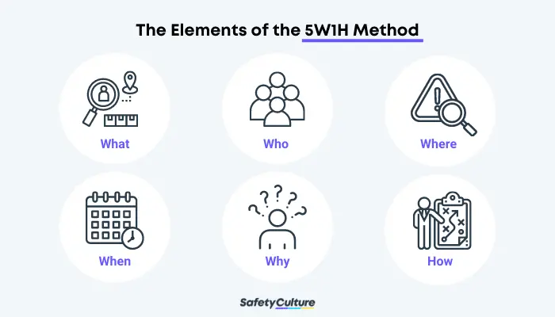
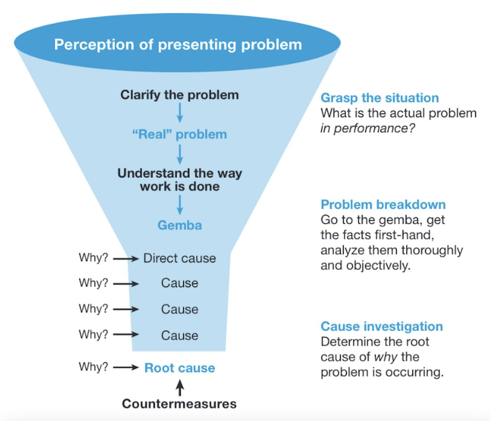

# 1. Understand the issue

When solving problems, there are different ways to understand the problem. However, to completely understand a problem, splitting it into several pieces is recommended. Generally, the process of understanding a problem can be four steps: define the problem, analyze the problem, frame the problem, and evaluate the problem.

In my opinion, when resolving issues, the understanding process is similar. However, the last step, evaluating the problem, is not to deeply understand the issue but to choose a solution to resolve the issue.

Below are some methods I recommend you use to understand the issue as detailed as possible.

### Define the issue using the 5W1H method

The **5W1H** method can help define the issue clearly and precisely and avoid confusion, ambiguity, and irrelevant information.

<figure><figcaption>
Credited by <a href="https://safetyculture.com/topics/5w1h/">safetyculture.com</a>
</figcaption></figure>

<table><thead><tr><th width="120">Element</th><th>Purpose</th></tr></thead><tbody><tr><td>What</td><td>Clearly describe the situation, the specific problem, or basically explain the purpose of the method usage. If possible, it should also state the overall goal for implementing the solution that would be identified.</td></tr><tr><td>Who</td><td>The specific people or group relevant to the issue or the situation. It should include the person who discovered the problem, who can possibly solve it, and who will be responsible for implementing the possible solution.</td></tr><tr><td>Where</td><td>Contain the exact location or position of the recognized issue. It can be a place, facility, or even a certain process where the solution is to be implemented.</td></tr><tr><td>When</td><td>Include all the components of the situation pertaining to anything related to dates. It should state the timeline, deadline, duration, or any other details that could help in the resolution of the problem.</td></tr><tr><td>Why</td><td>Explains in detail the reason and objectives behind the need for action.</td></tr><tr><td>How</td><td>Specifies the steps on how the identified plan/s should be carried out. It should also include all the resources, tools, methods, means, and even the expenditure needed for the endeavor to be effective.</td></tr></tbody></table>

#### Examples

* [Display a survey to PageFly users to collect their needs for the Black Friday campaign.](../example-1/1.-understand-the-issue.md#define-the-issue)
* [Fix pages published by PageFly losing styles on the storefront of a customer.](../example-2/1.-understand-the-issue.md#define-the-issue)

### Analyze the issue using the 5 Whys method

Analyzing the problem and identifying its root causes will help you understand why the problem exists and what factors contribute to it. To analyze the problem, you can use the **5 Whys** method.

<figure><figcaption>
Credited by <a href="https://www.lean.org/lexicon-terms/5-whys/">lean.org</a>
</figcaption></figure>

#### Examples

* [Display a survey to PageFly users to collect their needs for the Black Friday campaign.](../example-1/1.-understand-the-issue.md#analyze-the-issue)
* [Fix pages published by PageFly losing styles on the storefront of a customer.](../example-2/1.-understand-the-issue.md#analyze-the-issue)

### Frame the issue using the SMART method

Framing the problem and defining its scope and boundaries will help focus on the most relevant and important aspects of the problem and avoid distractions and biases. Making the problem statement specific, measurable, achievable, relevant, and time-bound (the **SMART** method) can help frame the problem.

<figure><figcaption>
Credited by <a href="https://www.indeed.com/career-advice/career-development/how-to-write-smart-goals">indeed.com</a>
</figcaption></figure>

<table><thead><tr><th width="138">Element</th><th>Purpose</th></tr></thead><tbody><tr><td>Specific</td><td>What will you achieve? What will you do?</td></tr><tr><td>Measurable</td><td>What data will you use to decide whether you've met the goal?</td></tr><tr><td>Achievable</td><td>Are you sure you can do this? Do you have the right skills and resources?</td></tr><tr><td>Relevant</td><td>Does the goal align with those of your team or organization? How will the result matter?</td></tr><tr><td>Time-bound</td><td>What is the deadline for accomplishing the goal?</td></tr></tbody></table>

#### Examples

* [Display a survey to PageFly users to collect their needs for the Black Friday campaign.](../example-1/1.-understand-the-issue.md#frame-the-issue)
* [Fix pages published by PageFly losing styles on the storefront of a customer.](../example-2/1.-understand-the-issue.md#frame-the-issue)

### Conclusion

PageFly is an application embedded in the Shopify admin UI and uses APIs provided by Shopify to work with data stored on Shopify servers. This situation causes some limitations to the app.

One of the limitations is that PageFly is loaded and runs inside an iframe on the Shopify admin UI. This behavior causes setting 3rd-party cookies is not allowed.


If you realize that the issue has no solution due to some limitations from Shopify that PageFly cannot control, you should report it to the issue creator **as soon as possible** to adjust the requirements.

