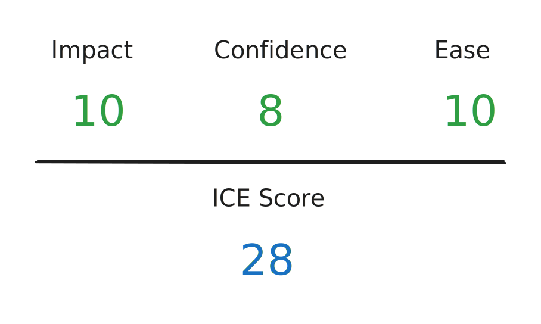

# 3. Choose the simplest and most effective solution


In software development, a **simple** solution can save a lot of coding, understanding, and debugging hours, not only for the developer who implements it but also for other developers who maintain it later.


We should rely on **simplicity**, **modularity**, **reusability**, and **flexibility** to evaluate and score each solution by **impact**, **confidence**, and **ease** (the ICE scoring method). Reusability and flexibility can be used to evaluate the impact score from 1 to 10. Modularity can be used to evaluate the confidence score from 1 to 10. Simplicity can be used to evaluate the ease score from 1 to 10. Then, you can sum the three scores to produce the final ICE score.


After evaluating **impact**, **confidence**, and **ease** scores for each solution, we can base on the ICE scores to find the simplest and most effective solution in every specific situation. If you cannot make a final decision, don't be afraid to discuss it with your teammates or leaders for more points of view.


Let’s resume the request to _“display a survey to PageFly users to collect their needs for the Black Friday campaign”_. We will evaluate and score each solution we found in [step 2](2.-find-at-least-two-solutions.md) by **impact**, **confidence**, and **ease**.

#### 3.1. Evaluate the first solution


The first solution is to code a stand-alone component that displays the predefined survey in the `pfcore` project and place it where the survey needs to show.


Although this solution can resolve the issue, it requires some manual work. For example, in the future, if either the design or marketing team needs to collect users’ needs for another event, we will need to update the survey hard-coded in the pfcore project and redistribute the code to the live app environment.


For this solution, we can:

* &#x20;_**Score 2 for the impact factor**_ because the solution is not flexible and also not reusable.
* _**Score 4 for the confidence factor**_ because while the component is independent, the hard-coded survey requires manual update and redistribution. So, if any mistake occurs or the survey content needs to be updated, it will need a longer time to fix.
* _**Score 8 for the ease factor**_ because while the solution requires more time to update code and redistribute the code if mistakes occur or the survey content needs to be updated, the initial implementation of it can be very fast.


#### 3.2. Evaluate the second solution


The second solution is defining the predefined survey as a constant in the `pfserver` project and including it in the global configuration. Then, code a stand-alone component in the `pfcore` project and place it where the survey needs to show. The component will look for any survey included in the global configuration and display it.


This solution requires less manual work than the first one. But if the survey content needs to be updated, it still needs to update the code in the `pfserver` project and redistribute it to the live app environment.


For this solution, we can:

* _**Score 6 for the impact factor**_ because while it is reusable and flexible, it still requires manually updating code and redistributing the code if the survey content needs to be updated.
* _**Score 6 for the confidence factor**_ because updating survey content still requires updating code and redistributing the code.
* _**Score 6 for the ease factor**_ because while the solution still requires time to update code and redistribute the code if the survey content needs to be updated, the initial implementation of it can be fast.


#### 3.3. Evaluate the third solution


The third solution is creating a dedicated collection in the database for saving surveys and their lifetime. We will insert the predefined survey into this collection as the first document.

Then, we will create an endpoint in the `pfserver` project for returning the survey content that should be shown at the current time (active survey).

Finally, code a stand-alone component in the `pfcore` project and place it where the survey needs to show. The component will automatically request the endpoint for an active survey and display it if available.


With this **overall** solution, we only need to code **once** and use it for **a long time**. After distributing the code, all actions related to surveys can be done in the database without the need for redistribution. This behavior allows a survey can be updated or removed instantly. Creating new surveys is also easy and instant.


For this solution, we can:

* _**Score 10 for the impact factor**_ because the solution is reusable and flexible and updating the survey content can be done in the database without the need of updating and redistributing code.
* _**Score 10 for the confidence factor**_ because inserting new surveys into the database or updating existing surveys in the database can be rapidly done without risks.
* _**Score 4 for the ease factor**_ because while the solution does not need updating code and redistributing the code if the survey content needs to be updated, the initial implementation of it requires more time than the other solutions.


#### 3.4. Conclusion

After scoring all solutions, we can conclude that the third solution should be the simplest and most effective solution with the highest ICE score of 24 (the second solution and the first solution have ICE scores of 18 and 14). But wait, we need to consider the required time-to-market (the due date of the Jira issue) before making the final decision.


The simplest and most effective solution is usually the solution that is **overall** and can be used for **a long time** without the need to update and redistribute code. But, if limited by the time-to-market, we can **temporarily** implement another solution that can be done fast then implement the overall and long-term solution later.


Suppose the due date of the Jira issue to _“display a survey to PageFly users to collect their needs for the Black Friday campaign”_ is the same day you receive the issue. We should choose the first solution (which has the shortest implementation time) to ensure the distribution of the feature in time. But, after releasing the feature to the live app environment, you should ask the owner of the issue to create another Jira issue for you to implement the long-term solution (the third solution).

Similarly, suppose the due date of the Jira issue is the next day. In that case, we should choose the second solution (slightly better than the first one) to ensure the feature will be distributed in time and create another Jira issue to implement the long-term solution.

On the other hand, if the time-to-market is not too close, implement only the third solution, which is the simplest and most effective solution.
