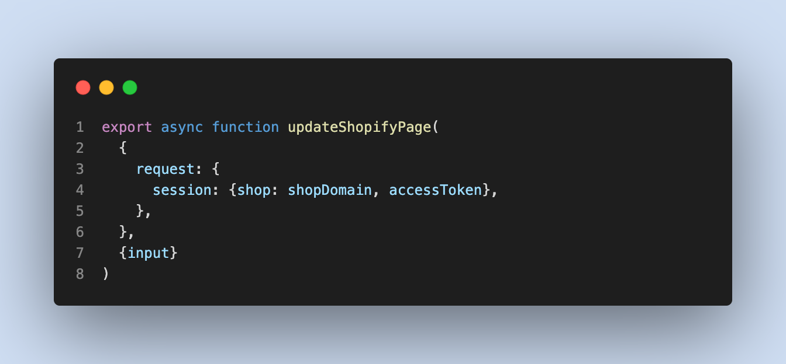

# Save and Publish Mechanism

### Frontend

#### Save mechanism

When you click the Save button on the HeaderBar, there are a bunch of things that have been done. In this case, I just introduce you to the `handleSavePage` function because ehhhhhhhh, you know, I think that is the most important part in the FrontEnd of this mechanism.

I will skip all the check conditions to focus on the main.&#x20;

<figure><figcaption>
Find this keyword if you need to do something with it
</figcaption></figure>

Because the function here is Save, so the parameter `publish` will be false.

<figure><figcaption>
If the conditions above are valid, then run the function menubarSavePage.
</figcaption></figure>

<figure><figcaption>
3 parameters, publish or save, silent: is autoSave or manualSave, abortController
</figcaption></figure>

menubarSavePage shows toast and UI changes, the main action in this function is `savePageData`

<figure><figcaption>
savePageData function
</figcaption></figure>

savePageData is a function that summarizes all general data like id, HTML, or CSS of the page/section. Then, all page data will be standardized, and prepared to send to the server. Here, we use the `prepareSaveData` function. The data contains lots of parameters, like `HTML`, `css`, `fonts`,  `elements`, `configs`, ....

<figure><figcaption>
data is standardized and prepared to send to the server.
</figcaption></figure>

After the preparation is completed, the next step will be to run `saveData`

<figure><figcaption>
saveData function with its params
</figcaption></figure>

This `saveData` is the final step on the FrontEnd side its mission is to send all summarized data to the server.

<figure><figcaption>
Send all data to the server.
</figcaption></figure>

#### Publish mechanism

The publish mechanism also has the same flow as the save mechanism, but it will include some conditions like slot usage check, ...

### Backend

After receiving the request from the client, the server will continue the rest of the work.

<figure><figcaption>
function updateShopifyPage in shopify-page-mutation.ts
</figcaption></figure>

####

&#x20;The server will receive the data from the request and validate all of them

<figure><figcaption>
validate data input
</figcaption></figure>

After confirming that all the data are valid, if the page has been published before and the page type has been changed, the server will send a request to Shopify to remove that page from the theme.

<figure><figcaption>
remove the current page and clean all data on that page
</figcaption></figure>

After the delete process is complete, the server will continue to create a new page with the validated data above, and send it to the Shopify theme to store. For each page type, there is a specific function to publish. For more details, please check the function `handleShopifyPage`

<figure><figcaption>
function handleShopifyPage to create a page on the Shopify theme
</figcaption></figure>

After being published successfully, we store the page data in our database.

<figure><figcaption>
store page data to our database 
</figcaption></figure>

If the type is section, update that section to the Shopify Theme

<figure><figcaption>
Update PageFly section list on the Shopify theme
</figcaption></figure>

That's it. All the information I gave you above is the whole of Save and Publish Mechanism. If you have any consider, please don't hesitate to ask and discuss together. Thank you.
