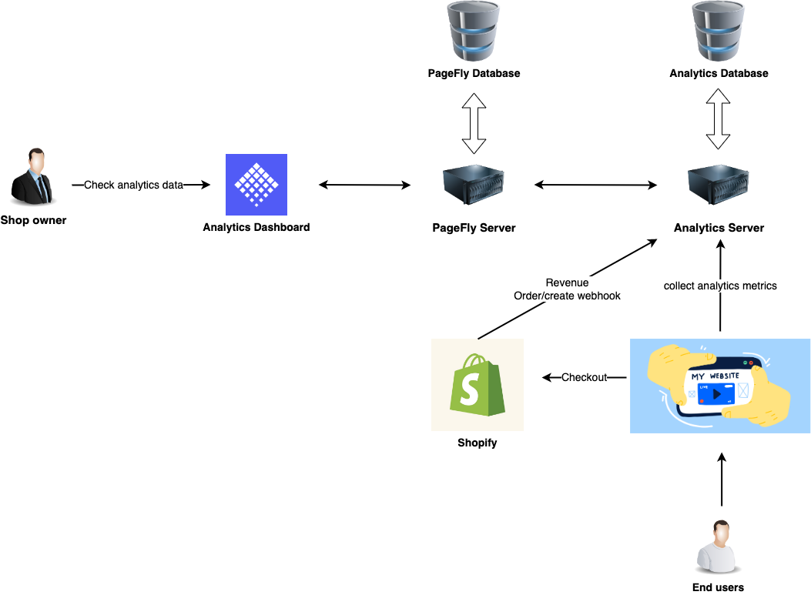

# How analytics work

Như biểu đồ trên có thể thấy Analytics có server và database riêng, khi endusers truy cập page thì collect request trực tiếp đến analytics server

Khi chủ shop muốn check analytics data trên analytics dashboard thì phải truy vấn qua trung gian là PageFly Server để lấy thêm thông tin về page (Có thể xem xét gọi trực tiếp đến analytics server trong tương lai để tối ưu hơn)
